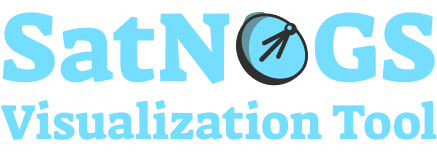

<p align="center">
  
</p>

<p align="center">
  
  
  
  
  
</p>

### Summary

- [About](#about)
- [Getting Started](#getting-started)
- [Building the app](#building-the-app)
- [Connecting to the Liquid Galaxy](#connecting-to-the-liquid-galaxy)
- [Setting up the rig](#setting-up-the-rig)
- [License](#license)
- [Privacy Policy and Terms & Conditions](#privacy-policy-and-terms--conditions)

### About

The project aims to collect and show data from satellites and ground stations using the SatNOGS [database](https://db.satnogs.org) and [API](https://db.satnogs.org/api/).

With the data available into the app, is possible to send it to the Liquid Galaxy system to be shown into Google Earth.

### Getting started

Before continuing, make sure to have installed in your machine [Git](https://git-scm.com/) and [Flutter](https://flutter.dev). Read [Flutter documentation](https://docs.flutter.dev) for further information.

Then, clone the project:

```bash
$ git clone https://github.com/LiquidGalaxyLAB/SatNOGS-Visualization-Tool.git
$ cd SatNOGS-Visualization-Tool
```

With the project cloned, run it by using the following command:

> ❗ You must have a mobile device connected or an android emulator running in order to run the app.

```bash
$ flutter run --no-sound-null-safety
```

> The `--no-sound-null-safety` flag is necessary due to the `ssh` package.

### Building the app

In order to have a installed version of the app, you may [download the APK](https://github.com/LiquidGalaxyLAB/SatNOGS-Visualization-Tool/tree/main/releases) in this repository or run the command below:

```bash
$ flutter build apk --no-sound-null-safety
```

> The `--no-sound-null-safety` flag is necessary due to the `ssh` package.

Once done, the APK file may be found into the `/build/app/outputs/flutter-apk/` directory, named `app-release.apk`.

### Connecting to the Liquid Galaxy

With the app opened, a cog button (⚙️) may be seen into the home page toolbar (top right corner). When clicked, it will lead you to the settings page, in which a form may be found.

Fill it up with the Liquid Galaxy host name, password, IP address and SSH connection port (change it only if the system `22` default SSH port was changed).

After done, click into the `Connect` button and check whether there's a `Connected` green label above the form, in case it doesn't, there's something wrong with the given information or your device connection.

Once connected, head back to the home page and use the app as you wish. Note that all of the data is kept into the local storage after the first load. To update it with the database data, tap the `SYNC` button into the toolbar, next to the cog button (⚙️).

### Setting up the rig

An important step to take is configure the slave screens for refreshing when setting solo KMLs.

To set it up, head to the settings page by hitting the cog button (⚙️) and go to the Liquid Galaxy tab.

In the button list, you shall see a button `SET SLAVES REFRESH` and `RESET SLAVES REFRESH`. The first one will setup your slave screens to refresh its solo KML every 2 seconds. The second one will make your slaves stop refreshing.

> ❗ _Both actions will **reboot** your Liquid Galaxy, so the changes may be applied._

### License

The SatNOGS Visualization Tool is licensed under the [MIT license](https://opensource.org/licenses/MIT).

### Privacy Policy and Terms & Conditions

Check out our [Privacy Policy](https://github.com/LiquidGalaxyLAB/SatNOGS-Visualization-Tool/blob/main/PRIVACY_POLICY.md) and [Terms & Conditions](https://github.com/LiquidGalaxyLAB/SatNOGS-Visualization-Tool/blob/main/TERMS_AND_CONDITIONS.md) to see more information about the application.
