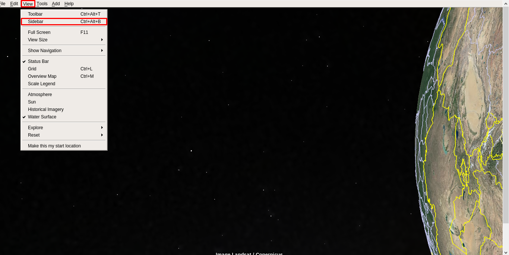
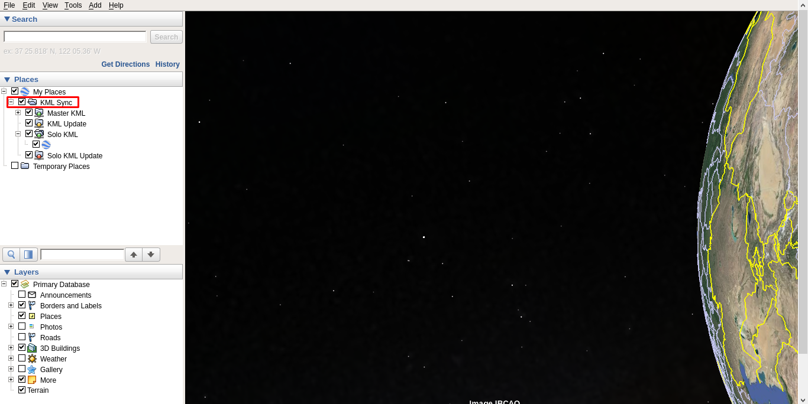
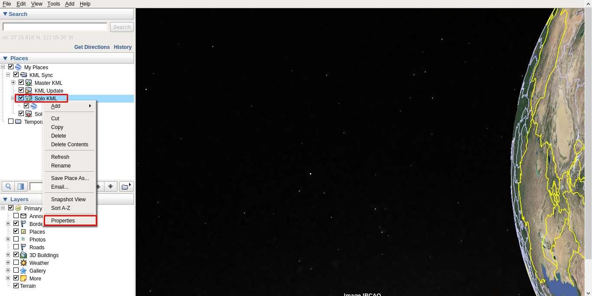
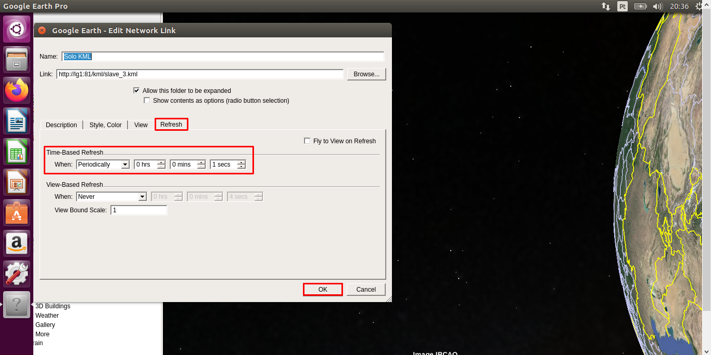

# SatNOGS Visualization Tool


### Summary

- [About](#about)
- [Getting Started](#getting-started)
- [Building the app](#building-the-app)
- [Connecting to the Liquid Galaxy](#connecting-to-the-liquid-galaxy)
- [Setting up the rig](#setting-up-the-rig)
- [License](#license)

### About

<p>
The project aims to collect and show data from satellites and ground stations using the SatNOGS [database](https://db.satnogs.org) and [API](https://db.satnogs.org/api/).

With the data available into the app, is possible to send it to the Liquid Galaxy system to be shown into Google Earth.

</p>

### Getting started

Before continuing, make sure to have installed in your machine [Git](https://git-scm.com/) and [Flutter](https://flutter.dev). Read [Flutter documentation](https://docs.flutter.dev) for further information.

Then, clone the project:

```bash
$ git clone https://github.com/LiquidGalaxyLAB/SatNOGS-Visualization-Tool.git
$ cd SatNOGS-Visualization-Tool
```

With the project cloned, run it by using the following command:

> ❗ You must have a mobile device connected or an android emulator running in order to run the app.

```bash
$ flutter run --no-sound-null-safety
```

> The `--no-sound-null-safety` flag is necessary due to the `ssh` package.

### Building the app

In order to build the app, run the following command:

```bash
$ flutter build apk --no-sound-null-safety
```

> The `--no-sound-null-safety` flag is necessary due to the `ssh` package.

Once done, the APK file may be found into the `/build/app/outputs/flutter-apk/` directory, named `app-release.apk`.

### Connecting to the Liquid Galaxy

With the app opened, a cog button (⚙️) may be seen into the home page toolbar (top right corner). When clicked, it will lead you to the settings page, in which a form may be found.

Fill it up with the Liquid Galaxy host name, password, IP address and SSH connection port (change it only if the system `22` default SSH port was changed).

After done, click into the `Connect` button and check whether there's a `Connected` green label above the form, in case it doesn't, there's something wrong with the given information or your device connection.

Once connected, head back to the home page and use the app as you wish. Note that all of the data is kept into the local storage after the first load. To update it with the database data, tap the `SYNC` button into the toolbar, next to the cog button (⚙️).

### Setting up the rig

An important step to take is configure the slave screens for refreshing when setting solo KMLs. Follow the steps below to
active solo KML refresh for each slave screen.

> ❗ Note that a mouse (and maybe a keyboard) will be needed to configure the Google Earth.

1. With Google Earth opened, press **CTRL+ALT+B** on the keyboard or click on the _**VIEW**_ tab on the tab bar and then _**Sidebar**_.


<br><br>

2. Into the Sidebar, expand the _**KML Sync**_ folder.


<br><br>

3. Right click on the _**Solo KML**_ folder and click on _**Properties**_.


<br><br>

4. Go to the _**Refresh**_ tab and change the _**Time-Based Refresh**_ to: **Periodically | 0hrs | 0mins | 1secs**
   - The recomended _**secs**_ if from 1 to 3 seconds.
   - Click on _**OK**_ and close the side bar by following the first step.


<br><br>

Done! Remember to do it for all slave screens so all of them will be reactive.

### License

The SatNOGS Visualization Tool is licensed under the [MIT license](https://opensource.org/licenses/MIT).
